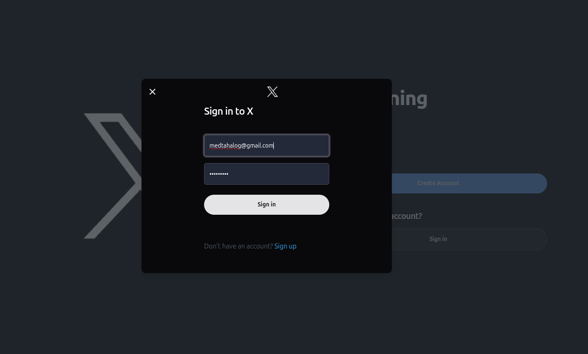
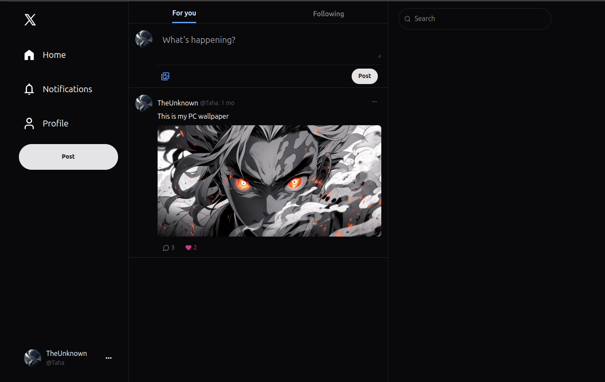
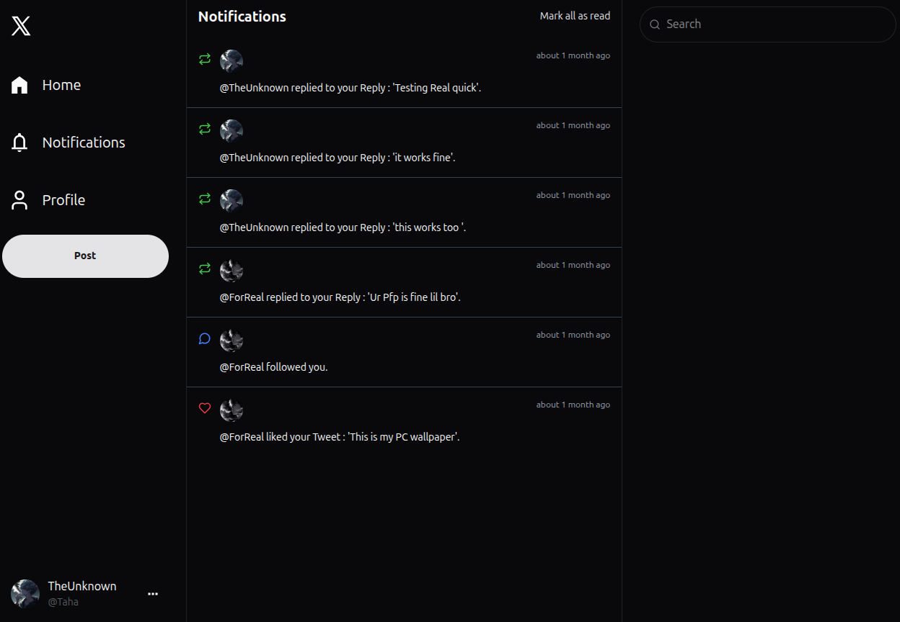
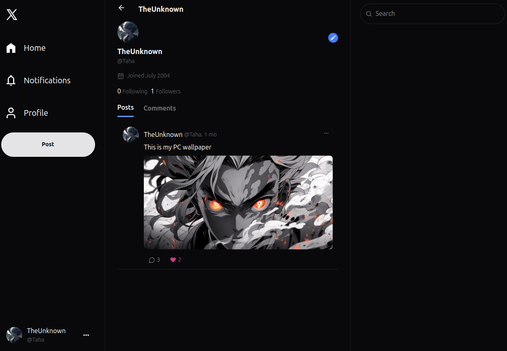
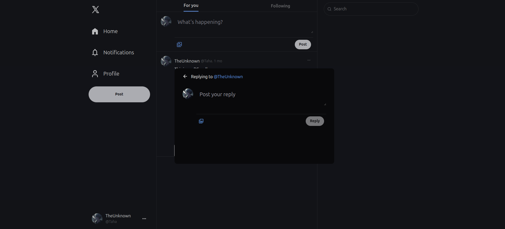

# xClone: A Fullstack Twitter Clone 🐦⚡

**xClone** is a modern, fullstack Twitter clone built with React, ASP.NET Core, and PostgreSQL. It features user authentication, tweeting, following, liking, and responsive UI components that replicate the core experience of Twitter.

---

## 📁 Repositories

| Layer      | Repository                                                                 |
|------------|----------------------------------------------------------------------------|
| 🌐 Frontend | [xCloneFrontEnd](https://github.com/TahaLoghmari/xCloneFrontEnd)          |
| ⚙️ Backend  | [xCloneBackEnd](https://github.com/TahaLoghmari/xCloneBackEnd)            |

---

## 🧠 Tech Stack

### 🔹 Frontend
- React + Vite
- TailwindCSS
- ShadCN UI
- JavaScript

### 🔹 Backend
- ASP.NET Core Web API
- Entity Framework Core
- PostgreSQL
- JWT Authentication

---

## ✨ Features

- 📝 Tweeting with text content
- ❤️ Like/unlike tweets
- 👤 User registration & login (JWT)
- 📇 Follow/unfollow users
- 🧾 User profile with tweets list
- 🔎 Basic feed/timeline
- 🖥️ Responsive UI (mobile + desktop)

---

## 🖼️ Screenshots

---

